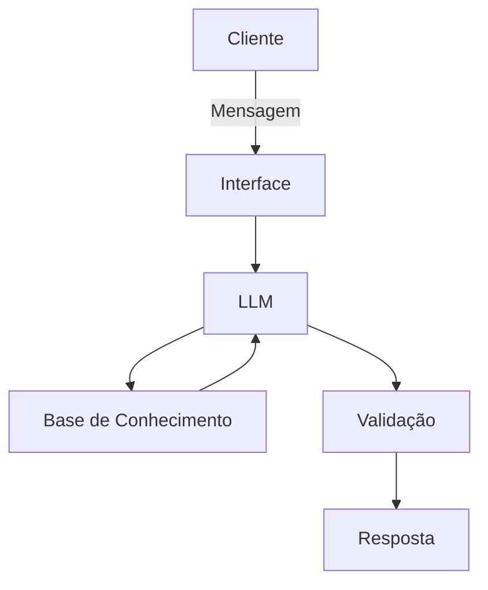

# 🧠 FinCoach AI — Assistente Financeiro Educacional com IA

O **FinCoach AI** é um assistente financeiro educacional baseado em inteligência artificial, desenvolvido em Python com foco em experiência do usuário (UX), simulação financeira e análise de dados pessoais.

O projeto simula um agente inteligente capaz de interpretar linguagem natural, analisar dados financeiros fictícios e gerar respostas educativas e contextualizadas.

---

## 🚀 Objetivo

Criar uma experiência digital interativa voltada à educação financeira, utilizando IA e dados estruturados para ajudar usuários a:

- Entender seus gastos
- Simular economia mensal
- Aprender conceitos financeiros básicos
- Visualizar sua situação financeira de forma simples
- Receber respostas personalizadas baseadas em seu perfil

---

## 🧠 Tecnologias Utilizadas

- Python
- Streamlit
- Pandas
- JSON / CSV
- Simulação de IA (rule-based chatbot)
- Base de dados financeira fictícia

---

## 📁 Estrutura do Projeto
📁 lab-agente-financeiro/
│
├── 📄 README.md
│
├── 📁 data/                          # Dados mockados para o agente
│   ├── historico_atendimento.csv     # Histórico de atendimentos (CSV)
│   ├── perfil_investidor.json        # Perfil do cliente (JSON)
│   ├── produtos_financeiros.json     # Produtos disponíveis (JSON)
│   └── transacoes.csv                # Histórico de transações (CSV)
│
├── 📁 docs/                          # Documentação do projeto
│   ├── 01-documentacao-agente.md     # Caso de uso e arquitetura
│   ├── 02-base-conhecimento.md       # Estratégia de dados
│   ├── 03-prompts.md                 # Engenharia de prompts
│   ├── 04-metricas.md                # Avaliação e métricas
│   └── 05-pitch.md                   # Roteiro do pitch
│
├── 📁 src/                           # Código da aplicação
│   └── app.py                        # (exemplo de estrutura)
│
│
└── 📁 examples/                      # Referências e exemplos
    └── README.md


---

## 💡 Funcionalidades

### 📊 Dashboard Financeiro
- Total de gastos
- Gastos por categoria
- Identificação de gastos não essenciais

### 💰 Simulação Financeira
- Simulação de economia mensal
- Projeção de 12 meses

### 💬 Chat Inteligente
- Respostas baseadas em linguagem natural
- Análise de gastos
- Consulta de perfil financeiro
- Explicações educacionais

### 👤 Personalização
- Uso de perfil financeiro do usuário
- Adaptação das respostas ao nível de conhecimento

---

## 📊 Exemplo de Uso

### 🧑‍💬 Pergunta:
```
Quanto eu gasto por mês?
```

### 🤖 Resposta:
```
Você gastou aproximadamente R$ 1.589,90 no período analisado.
Os maiores gastos estão nas categorias de alimentação e moradia.
```

---

### 🧑‍💬 Pergunta:
```
Posso economizar quanto em 1 ano guardando R$ 200 por mês?
```

### 🤖 Resposta:
```
Se você economizar R$ 200 por mês, ao final de 12 meses terá R$ 2.400.
```

---

## 📈 Exemplo de Insight Gerado

- Gastos não essenciais representam ~15% do orçamento
- Potencial de economia mensal: R$ 150 a R$ 300
- Reserva de emergência atual: 66% concluída

---

## 🎯 Arquitetura do Sistema



## 🧪 Exemplo de Dados
📄 Transações
data,descricao,categoria,valor,tipo
2025-10-01,Salário,receita,5000.00,entrada
2025-10-03,Supermercado,alimentacao,450.00,saida

## 👤 Perfil do Usuário
{
  "nome": "Ana Maria",
  "perfil_financeiro": "moderado",
  "renda_mensal": 2000.00
}

## 📚 Conceitos Aplicados
Inteligência Artificial aplicada a UX
Processamento de linguagem natural (simulado)
Engenharia de dados financeiros
Simulação de cenários econômicos
Design de experiência conversacional
Personalização baseada em perfil

## 🔒 Segurança e Limitações
O agente não realiza recomendações financeiras reais
Todas as simulações são educativas e hipotéticas
Não substitui consultoria financeira profissional
Respostas são baseadas em dados fornecidos localmente

## 🚀 Possíveis Melhorias Futuras
Integração com APIs reais de mercado financeiro
Uso de LLM (GPT / OpenAI API)
Memória conversacional persistente
Entrada por voz (Speech-to-Text)
Dashboard mais avançado com gráficos dinâmico

## 🏆 Projeto para DIO
Este projeto foi desenvolvido como parte de um desafio educacional da DIO, com foco em:
IA generativa aplicada
UX conversacional
Simulação financeira
Estruturação de dados
Experiência digital interativa

## 👨‍💻 Autor: Lívia Bento Mano
Projeto desenvolvido como parte de estudos em Inteligência Artificial, Python e UX aplicada.

## 📌 Referências
https://streamlit.io/
https://pandas.pydata.org/
https://huggingface.co/
https://openai.com/
https://docs.python.org/3/
